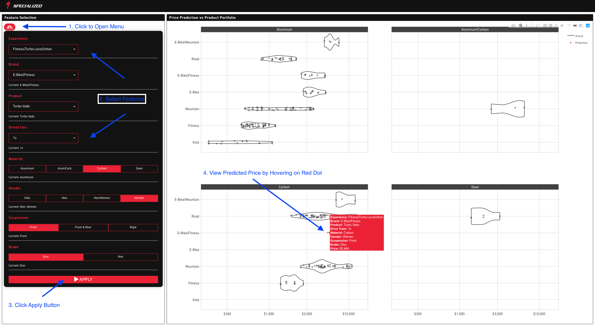

### Price Prediction Dashboard: Specialized Bikes

#### Introduction

This is a dashboard created using Shiny and FlexDashboard. Core packages used include the tidyverse suite for data manipulation, ggplot & plotly for visualization and parsnip & XGBoost for ML-based price prediction. The data was procured from [Specialized.com](https://www.specialized.com) using the Rvest web-scraping library. Featured on the Business Science blog. 

Dashboard: [Link](https://joon.shinyapps.io/specialized_price_prediction)

Data Source: [Scraped from Specialized site](https://www.specialized.com)

Blog: [Business Science Blog](https://www.business-science.io/code-tools/2019/10/07/rvest-web-scraping.html)
